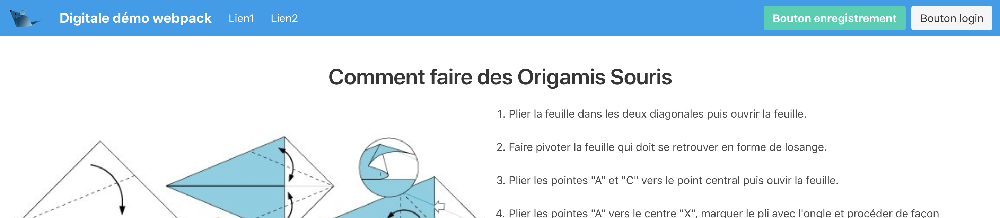

*********
Web front
*********

Comment j'ai découvert le Web
=============================

* client (front): affichage de contenu html5, css3, javascript. Pour apprendre :
    * http://www.w3schools.com
    * https://developer.mozilla.org/en-US/docs/Learn/Getting_started_with_the_web
    * http://www.thenetninja.co.uk
    * https://wiki.centrale-marseille.fr/informatique/public:developpement_web

* serveur (back). Peut dans un sens très (trop) large :
    * servir du contenu html, css, js
    * servir des fichiers binaires/textes
    * fonctionnement asynchrone par défaut mais aussi synchrone (websocket)
    * stockage et accès à des données côté serveur (api rest, crud) ou client (cookies)

* communication entre front et back par le protocole http ou https.

HTML
====

.. note:: faire en direct avec le lien vers un navigateur.

Le HTML est un langage à balise. C'est-à-dire qu'il est toujours en deux parties. Par exemple : :code:`<head></head>` et :code:`<body></body>`.
Structure de base d'un document : http://www.alsacreations.com/article/lire/1374-html5-structure-globale-document.html
Juste un petit exemple, on en refera par la suite, c'est juste pour ne pas être (trop) perdu.
Le navigateur interprétera directement le fichier. On ne passe pas par un serveur,
il utilise directement le fichier avec l'URI (https://fr.wikipedia.org/wiki/Uniform_Resource_Identifier)  :code:`file://chemin/absolu/vers/fichier.html`

.. code-block:: html

	<!doctype html>
    <html>
        <head>
            <meta charset="utf-8" />
            <title>Maison page</title>
        </head>
        <body>
            <h1>Enfin du web !</h1>
            
Et on aime ça.

        </body>
    </html>

Le HTML crée un arbre (via les balises imbriquées). Il est appelé arbre DOM (Document Object Model).

Ajout du CSS
============

.. note:: Faire uniquement le début pour voir les changements s'effectuer en direct.

Le CSS est ajouté directement sur la page grâce à la balise :code:``.

.. code-block:: html

	<!doctype html>
    <html>
        <head>
            <meta charset="utf-8" />
            <title>Maison page</title>

            <!--        https://fonts.google.com-->
            <link href="https://fonts.googleapis.com/css?family=Indie+Flower" rel="stylesheet">

            
        </head>
        <body>
            <h1>Enfin du web !</h1>
            
Et on aime ça.

        </body>
    </html>

Pour la couleur, on la gère en hexadécimal RGB sur 32bits 8 par channel.

* Pour un aperçu des couleurs : https://color.adobe.com/fr/.
* Pour les couleurs en hexadécimal pour faire du développement web : https://www.w3schools.com/colors/colors_names.asp.

Apparté pour github
===================

On a un premier site qui fonctionne. Il n'a qu'un fichier mais il marche. On peut donc créer un repository git, puis crer un repository central sur github. Ceci nous permettra de facilement partager le code et de mettre en production très facilement (c'est devops de partout).

projet git
----------

On commence par se placer à la racine du site avec votre terminal/powershell, puis :

 .. code-block:: sh

    git init

On peut voir l'état dans le quel est notre projet :

.. code-block:: sh

   git status

qui devrait rendre :

.. code-block:: sh

    On branch master

    No commits yet

    Untracked files:
    (use "git add <file>..." to include in what will be committed)

    index.html

    nothing added to commit but untracked files present (use "git add" to track)

On peut donc sauvegarder notre premier commit :

.. code-block:: sh

    git add index.html
    git commit -m "first commit"

github
------

Pour facilement mettre un projet en production et avoir un projet de référence, on va mettre le code sur https://github.com/

Ceci participe de l'adage : "ce qui se fait souvent doit se faire rapidement", ici la mise en production.

* Si ce n'est pas encore fait créez vous une paire de clés ssh et ajoutez la clé public à votre compte github : https://help.github.com/articles/adding-a-new-ssh-key-to-your-github-account/
* Créez un nouveau projet sur github https://help.github.com/articles/creating-a-new-repository/
* ajouter le projet github nouvellement créer à notre projet git :  https://help.github.com/articles/adding-an-existing-project-to-github-using-the-command-line/

Par exemple, chez moi après avoir ajouté la ligne :

.. code-block:: sh

    git remote add origin git@github.com:FrancoisBrucker/test_cours.git

Mon fichier de conf `.git/config`  ressembre à :

.. code-block:: sh

  [core]
      repositoryformatversion = 0
      filemode = true
      bare = false
      logallrefupdates = true
      ignorecase = true
      precomposeunicode = true
  [remote "origin"]
      url = git@github.com:FrancoisBrucker/test_cours.git
      fetch = +refs/heads/*:refs/remotes/origin/*

On peut maintnenant envoyer le projet sur github :
.. code-block:: sh

  git push origin master

Voyez le résultat sur votre compte github.

Github vous demande de rajouter un fichier README.md pour décrire ce qu'est NOTRE PROJET ! Faisons le directement sur le site (.md est pour markdown, un façon sympathique d'écrire du texte : https://github.com/adam-p/markdown-here/wiki/Markdown-Cheatsheet)

On en profitera alors également pour ajouter :

    * un fichier de license :  https://help.github.com/articles/adding-a-license-to-a-repository/ J'ai une petite préférence pour la license IV ou la WTFPL (https://github.com/jslicense/WTFPL ) mais à vous de voir
    * un fichier .gitignore . Vous pouvez le laisser pour l'instant, ou choisir un template. Les utilisateurs de mac peuvent cepndant dés à présent y ajouter la ligne .DS_Store

Notre programme diffère maintenant entre ce qui est sur github et sur notre machine. On va récupérer le tout :
.. code-block:: sh

  git pull origin master

.. note::  ?? comment conaitre les différences entre les 2 ??

ovh
---

La dernière pointe du triangle va être de mettre NOTRE PROJET ! sur le server ovh.

On commence par se connecter sur le serveur ovh  :

.. code-block:: sh

    ssh raifort@ovh1.ec-m.fr

Puis on va cloner le projet de github sur notre page web.

.. code-block:: sh

    cd www
    git clone https://github.com/FrancoisBrucker/test_cours

Comme vous pouvez le remarquer dans le fichier de config, l'origin est placée directement.

Tout est maintenant visible à l'adresse : http://raifort.ovh1.ec-m.fr/test_cours/

Lorsque l'on voudra mettre à jour le site, il suffira de faire un :

.. code-block:: sh

  git pull origin master

Ou de créer un script que le fera de façon automatique, sans même avoir à se logger sur la machine distante.

Les div et pourquoi c'est important
===================================

Les div (ou span) sont des blocs anonymes :

* span: sur une ligne. Ils sont placés les un à côtés des autres (propriété display en css). Comme un img ou un strong;
* div: un bloc les un en dessous des autres. Comme un p, ou un h1.

Elles ne vont être caractérisées que par les classes/id css qu'on leur mettra :

* class: plusieurs paramètres peuvent avoir la ou les mêmes classes;
* id: unique pour un bloc particulier.

On peut très finement caractériser la portée d'un sélecteur css : https://www.w3schools.com/cssref/css_selectors.asp

Attention cependant :

* une caractérisation chasse l'autre (donc on mettra ses propres fichiers css en dernier);
* les propriétés sont appliquées de la plus générale à la plus spécifique (qui masque donc la plus générale);
* il est compliqué de centrer verticalement (on le fera donc rarement tout seul).

.. code-block:: html

  <html>
    <head>
      <title>Maison Page</title>

    </head>
    <body>
      

      <h1> Enfin du web !</h1>
      
 et on aime ça

      

    </body>
  </html>

Un framework web
================

Faire du javascript à la mimine, c'est rigolo deux minutes mais vite ça devient pénible. Dans la plupart des cas on utilisera des frameworks pour s'éviter de maintenir trop de css (comme bootstrap, ou bulma que l'on utilisera ici). Si l'on est vraiment obligé de faire beaucoup de css,

bulma : https://bulma.io

.. note:: un tuto : https://scotch.io/bar-talk/get-to-know-bulma-my-current-favorite-css-framework

.. code-block:: html

  <!doctype html>

  <html>
  <head>
      <meta charset="utf-8" />
      <title>Maison page</title>
	
      <link href="./bulma-0.7.1/css/bulma.css" rel="stylesheet">
  </head>

  <body>
  <section class="hero is-info is-small">
      

          

              <h1 class="title">Enfin du web</h1>
              <h2 class="subtitle has-text-right">Et on aime ça</h2>

          

      

  </section>

  

    

      First column
    

    

      Second column
    

    

      Third column
    

    

      Fourth column
    

  

  </body>
  </html>
  

Gestion de packages
===================

Plutôt que de tout installer à la main et de ne plus se souvenir qui est quoi, on a coutume d'installer un gestionnaire de package. Le plus célèbre en front est :code:`npm` l'installeur de node (Node Package Manager). Il y a des alternatives comme :code:`yarn` mais restons (pour une fois) classique.

Commençez par installer node.

Puis : 
    #. :code:`npm init` (on crée le fichier de configuration),
    #. :code:`npm install bulma --save` (ajout de la dépendance bulma dans :code:`package.json`).
    
Si on oublie :code:`--save` le package est installé mais pas ajouté dans le fichier de config (regardez le fichier de configuration). Il est toujours bon de se souvenir des packages que l'on installe (on le verra sur l'ovh). 

.. note:: 
Il y a de tout sur :code:`npm`. Quasiment tout le monde peut poster des packages. Donc Le meilleur y cotoie le pire, comme https://github.com/kevva/is-negative . Je vous rassure, il y a aussi https://github.com/kevva/is-positive mais bizarrement pas https://github.com/kevva/is-zero.
    
    
Le lien vers bulma devient alors : :code:`<link href="./node_modules/bulma/css/bulma.css" rel="stylesheet">`

.. note:: sauvegardez git et placez vous sur l'ovh pour refaire le projet. Un simple git pull puis npm init va suffire ! C'est y pas beau ça ? 

Tests
=====

.. note :: 

    `<https://www.slideshare.net/robertgreiner/test-driven-development-at-10000-feet>`_
    regardez en particulier la courbe décroissante.

Côté Client
-----------

Tests côté front
================

On fera plutôt des tests fonctionnels en racontant des petites histoires que doit satisfaire notre site, mais on peut aussi voir si nos balises html se placent bien.

webdriver.io
------------

On peut tester le rendu client en simulant un navigateur.

Pour cela on utilise Selenium `<http://www.seleniumhq.org>`_ et ses webdrivers qui simulent un browser. Tout ceci fonctionne en java, donc assurez vous d'avoir un java qui corresponde.
Étapes à suivre :

#. installation de java (si nécessaire. Tapez java dans un terminal/powershell et si ça rate, c'est qu'il faut l'installer) : `<https://www.java.com/fr/download/faq/develop.xml>`_ et suivez le lien pour télécharger le jdk.
#. récupérer le fichier jar de Selenium standalone server : `<http://www.seleniumhq.org/download/>`_.
#. ajouter un driver. Nous utiliserons celui de Chrome : `<https://sites.google.com/a/chromium.org/chromedriver/>`_. Il y en a d'autres possibles (par exemple pour Firefox : `<https://github.com/mozilla/geckodriver/releases>`_).

Une fois Selenium et le driver placé dans un dossier Selenium. Je l'ai placé dans le dossier parent de l'application. On peut tester pour voir si ça marche. En utilisant ce que j'ai téléchargé et mis dans le même dossier : :code:`java -Dwebdriver.chrome.driver=./chromedriver -jar selenium-server-standalone-3.14.jar`

sous windows la commande devient : :code:`java "-Dwebdriver.chrome.driver=chromedriver.exe" -jar "selenium-server-standalone-3.14.0.jar"`

.. note:: Attention à la version du serveur selenium et au driver que vous utilisez.

Un serveur web Selenium est lancé. Il est sur le port 4444 par défaut (lisez les logs).

.. note :: Java est toujours verbeux dans ses logs. Apprenez à les lire.

Et maintenant, il nous reste à installer `<http://webdriver.io>`_ pour utiliser Selenium avec Node : :code:`npm install --save-dev webdriverio`

.. note :: On a installé webdriver.io uniquement pour le développement. Il n'est pas nécessaire de l'emmener avec nous en production. voir https://docs.npmjs.com/cli/install

Et on fait un premier essai avec le tout dans : :code:`selenium.test.js` dans un repertoire de test :

.. code-block:: js

    var webdriverio = require('webdriverio');

    var options = {
        desiredCapabilities: {
            browserName: 'chrome'
        }
    }

    webdriverio
    .remote(options)
    .init()
    .url('https://www.google.fr')
    .saveScreenshot("snapshot.png")
    .catch(function(err) {
        console.log(err);})
    .end();

Avant d'exécuter le fichier avec :code:`node ./tests/selenium.test.js` On s'assure que le serveur Selenium tourne toujours sur le port 4444.

.. note :: Assurez vous de ne part avoir de serveur qui tourne sur le port par défaut. Sinon, changez de port par défaut.

On peut maintenant faire la même chose pour notre fichier :

.. code-block:: js

    var webdriverio = require('webdriverio');
    var path = require('path');

        var options = {
            desiredCapabilities: {
                browserName: 'chrome'
            }
        }

    var toUpload = path.join(__dirname, '..', '/index.html')

    webdriverio
        .remote(options)
        .init()
        .url('file://' + toUpload)
        .saveScreenshot("snapshot.png")
        .catch(function(err) {
            console.log(err);})
        .end();

Notez que l'on a ajouté un module (:code:`path`) pour concaténer des chemins (NE JAMAIS LE FAIRE A LA MAIN !) et utilisé la variable spéciale :code:`__dirname` qui rend le repertoire où est le fichier qui est entrain d'être lu (ici :code:`selenium.test.js`).

Pour l'instant ce ne sont pas de vrais tests. Pour cela, on va utiliser une bibliothèque de test (ici https://mochajs.org/).

Commençons par voir ce que l'on veut tester :

.. code-block:: js

	var webdriverio = require('webdriverio');
	var path = require('path');

	var options = {
	    desiredCapabilities: {
	        browserName: 'chrome'
	    }
	}
	var toUpload = path.join(__dirname, 'index.html')

	browser = webdriverio
	    .remote(options)
	    .init()
		.url('file://' + toUpload)
	.getTitle().then( (title) => {
	    console.log("titre : " + title)
	})
	.getText('h1.title').then((title) => {
	    console.log("h1 : " + title)
	})
	.catch(function(err) {
	    console.log(err);
	    })

	.end()

.. note :: Attention au .end(). Tout est asynchrone donc si on ajoute une ligne avec le .end(), il risque d'être exécuté avant la fin de la requête.

On peut attraper plein de choses avec Selenium et Webdriver.io en utilisant les selecteurs : `<http://webdriver.io/guide/usage/selectors.html>`_

mocha
^^^^^

On peut finalement rajouter tous nos tests à la batterie de tests de Node en créant un dernier morceau notre fichier avec le nom

on utilise toujours celui dans node_modules. Sur le serveur on peu en avoir un vieux. Et on ajoute la ligne dans les tests.

Les tests js et de routes sont lents par rapport aux tests python ou java. C'est comme ça. Mais il faut tout de même en faire.

* la bibliothèque de tests : :code:`npm install mocha --save-dev`
* ecrire des jolis tests : :code:`npm install chai --save-dev`

Le code des tests :code:`mocha` pour le fichier : :code:`./tests/index.test.js` :

https://medium.com/@ChrisDobler/getting-started-guide-to-browser-testing-with-webdriver-io-and-mocha-and-chai-323c2ff3c773

A expliquer :

* tout est asynchrone. Donc on ne continue qu'après le :code:`done()`
* before est exécuté avant les tests. Si on ne mets pas done, gettitle va rater puisque la page ne sera pas chargée. Faite le test
* after est exécuté après les tests. On log les erreurs et on stope le browser

.. code-block:: js

    var webdriverio = require('webdriverio');
    var path = require('path');

    const expect = require('chai').expect;

    var options = {
        desiredCapabilities: {
            browserName: 'chrome'
        }
    }
    const browser = webdriverio.remote(options);

    let toUpload = path.join(__dirname, '..', 'index.html')

    describe('index tests', function() {
        before(function(done) {
            browser.init().url('file://' + toUpload)
                .then(() => {done();})
                .catch((err) => done(err));
          });

          after(function() {
          browser
              .catch((err) => { console.log(err);})
              .end();
          });

        it('page title', function(done) {
            browser.getTitle().then((title) => {
              expect(title).to.equal('Maison page');
              done();
            }).catch((err) => done(err));
        });

        it('h1 title', function(done) {
            browser.getText('h1.title').then((title) => {
              expect(title).to.equal('Enfin du web');
              done();
            }).catch((err) => done(err));
        });

    });

On lance le test avec la comande : :code:`./node_modules/.bin/mocha ./tests/index.test.js --timeout 0`

A expliquer :

* :code:`timeout` il faut le temps de lancer le nvigateur, de charger la page, etc. Par défaut c'est 2 secondes et c'est trop court (tester le sans)
* on utilise le :code:`mocha` installé, il n'existe pas globalement (a priori)

JS (côté front)
===============

Permet la modification de l'arbre DOM.

Le script est exécuté lorsqu'il est lu : il est souvent exécuté à la fin du html ou via un évènement lancé après que la page soit chargée.

Le javascript permet de modifier cet arbre DOM via des évènements : https://www.w3schools.com/jsref/dom_obj_event.asp.

.. code-block:: html

  <html>
    <head>
      <title>Maison Page</title>

    </head>
    <body>
      

      <h1> Enfin du web !</h1>
      
 et on aime ça

      

      
    </body>
  </html>

On peut aussi faire plus compliqué :

.. code-block:: html

  

Comme c'est compliqué comme ça, on utilise souvent (toujours ?) des bibliothèques.

Une nouvelle tendance émerge comme utiliser d'autres langages puis on les "compile" en javascript : https://www.transcrypt.org

Javascript et jQuery
--------------------

.. note::

    * Commencer par n'installer que jQuery
    * aller dans les outils de développement et montrer ce que l'on a
    * jouer avec jQuery :code:`$("p").html()` un peu.
    * dire qu'il faut que tout soit chargé avant que ça marche.

Ajout de la bibliothèque jQuery (http://jquery.com) directement depuis un CDN
(https://fr.wikipedia.org/wiki/Content_delivery_network) et d'un peu de code javascript avec la balise :code:``.

Notez le côté purement fonctionnel de la programmation (ici fin de chargement, entrée/sortie d'un sélecteur).

.. code-block:: html

	<!doctype html>
    <html>
        <head>
            <meta charset="utf-8" />
            <title>Maison page</title>

            <!--        https://fonts.google.com-->
            <link href="https://fonts.googleapis.com/css?family=Indie+Flower" rel="stylesheet">

            

            
            

        </head>
        <body>
            <h1>Enfin du web !</h1>
            
Et on aime ça.

        </body>
    </html>

Le Javascript est un langage très utilisé en front. C'est pas le plus beau mais avec la version ES6 (https://fr.wikipedia.org/wiki/ECMAScript), ça commence à ressembler à quelque chose.

.. image:: _static/javascript_the_good_parts.jpg

.. note:: Un peu de lol. Javascript en entier vs ce qui en est utilisé.

Nous allons l'utiliser aussi côté back, avec *node*.

On va tout de suite installer node pour utiliser son gestionnaire de package npm
(https://www.npmjs.com) ou un
équivalent yarn (https://yarnpkg.com/lang/en/).

.. code-block :: sh

  yarn init
  yarn install

JS UI
-----

Pour fabriquer des UI, JS est un bon outil, muni des bons frameworks.
 Le très connu et reconnu https://reactjs.org, ou encore https://vuejs.org

Orienté jeu/2D : Pixijs (http://www.pixijs.com)

WEBPACK
=======
Webpack est un compilateur de Javascript et de CSS. On le qualifie souvent de bundler car il permet de regrouper les fichiers de dépendances souvent nombreux en peu de fichiers; on va l'appliquer à l'exemple simple de cette page web statique qui utilise Bulma, jQuery et une feuille de style qui lui est propre.

Actuellement, le code de la page ressemble à ça, et on peut remarquer que tout ce qui est nécéssaire (CSS, JS) est mis en vrac. Webpack va nous permettre de tout "bundler" pour rendre l'usage des feuilles de style et des scripts plus propre.
Ce projet nécéssite deux images pour fonctionner, vous pouvez aller les chercher dans le dossier _static du projet (:code:`digit.png` et :code:`plan-origami.png`)

.. code-block:: html

	<!doctype html>
    <html>
        <head>
            <meta charset="utf-8" />
            <title>Maison page</title>
            <link href="https://cdnjs.cloudflare.com/ajax/libs/bulma/0.7.2/css/bulma.css" rel="stylesheet">
            
            
            
        </head>
    <body>
    <nav class="navbar is-info" role="navigation" aria-label="main navigation">
        

            
            <a role="button" class="navbar-burger burger" aria-label="menu" aria-expanded="false" data-target="navbarBasicExample">
                
                
                
            </a>
        

        

            

                <a class="navbar-item titre-navbar">
                    Digitale démo webpack
                </a>
                <a class="navbar-item">
                    Lien1
                </a>
                <a class="navbar-item">
                    Lien2
                </a>
            

            

                

                    

                        <a class="button is-primary">
                            <strong>Bouton enregistrement</strong>
                        </a>
                        <a class="button is-light">
                            Bouton login
                        </a>
                    

                

            

        

    </nav>
    

    
Comment faire des Origamis Souris

    

        

            
        

        

            <ol type="1">
                <li>Plier la feuille dans les deux diagonales puis ouvrir la feuille.</li> 
                <li>Faire pivoter la feuille qui doit se retrouver en forme de losange.</li> 
                <li>Plier les pointes "A" et "C" vers le point central puis ouvir la feuille.</li> 
                <li>Plier les pointes "A" vers le centre "X", marquer le pli avec l'ongle et procéder de façon identique avec le point "C".</li> 
                <li>Replier le point "D" vers le point "X" et marquer le pli avec l'ongle.</li> 
                <li>Rabattre le point "B" en suivant la ligne verticale centrale.</li> 
                <li>Rabattre les 2 angles du haut vers la ligne centrale.</li> 
                <li>Plier vers l'extérieur les angles"1" en suivant une diagonale partant de l'angle "Z".</li> 
                <li>Procéder de façon identique avec l'angle "2".</li> 
                <li>Retourner le pliage.</li> 
                <li>Rabattre la pointe du haut vers le centre comme sur le modèle.</li> 
                <li>Retourner le pliage.</li> 
                <li>Plier le long de la ligne centrale verticale.</li> 
                <li>Contreplier les oreilles pour les ouvrir.</li> 
            </ol>
        

    

    

    </body>
    </html>

Pour commencer, il faut s'assurer que vous êtes dans un dossier de travail, où npm est initialisé; si ce n'est pas fait, faites :code:`npm init -y`

Dans ce dossier, vous devez faire plusieurs choses :
  * Créer un dossier :code:`public`, dans lequel vous devrez placer le :code:`index.html` et créer un fichier :code:`bundle.js` (vide pour le moment)
  * Créer un dossier :code:`src` et y placer un fichier :code:`index.js` (aussi vide pour le moment)
  * A la racine du dossier, créer un fichier :code:`webpack.config.js`
  * Enfin, créer un dossier :code:`assets` qui contiendra lui même deux dossiers : :code:`images` et :code:`stylesheets`

Maintenant, nous allons installer Webpack et ce dont nous avons besoin :

.. code-block:: bash

    npm install -g webpack@latest
    npm install --save-dev webpack@latest webpack-dev-server@latest webpack-cli@latest
    npm install --save-dev babel-loader babel-core babel-preset-env
    npm install --save-dev sass-loader node-sass css-loader style-loader autoprefixer postcss-loader
    npm install --save-dev extract-text-webpack-plugin file-loader copy-webpack-plugin

Normalement, un dossier :code:`node_modules` est apparu et vous pouvez voir dans votre fichier :code:`package.json` que les dépendances sont apparues dans la section :code:`devDependencies`.

Ensuite, on édite le fichier :code:`webpack.config.js`

.. code-block:: js

    const webpack = require("webpack");
    const path = require("path");
    const ExtractTextWebpackPlugin = require("extract-text-webpack-plugin");
    const CopyWebpackPlugin = require('copy-webpack-plugin');
    let config = {
        mode: "development",
        entry: "./src/index.js",
        output: {
            path: path.resolve(__dirname, "./public"),
            filename: "./bundle.js"
        },
        module: {
            rules: [{
                test: /\.js$/,
                exclude: /node_modules/,
                loader: "babel-loader"
            },
                {
                    test: /\.scss$/,
                    use: ExtractTextWebpackPlugin.extract({
                        fallback: 'style-loader',
                        use: ['css-loader', 'sass-loader'],
                    })
                }]
        },
        plugins: [
            new ExtractTextWebpackPlugin("styles.css"),
            new CopyWebpackPlugin([
                { from: './assets/images', to: 'images' }
            ])
        ]
    }
    module.exports = config;

Il faut noter que :code:`entry` correspond aux fichiers à compiler (dans notre cas :code:`index.js`) et :code:`output`
à l'emplacement que nous voulons donner à notre fichier compilé et au nom qu'on veut lui donner (:code:`bundle.js` ici)

Enfin, dans la section script du :code:`package.json`, on ajoute la ligne :code:`"watch": "webpack --watch"`

On installe maintenant les deux dépendances de notre projet (jQuery et Bulma)
:code:`npm install jquery bulma`

Puis on réduit notre code html en séparant dans chacun des fichiers le contenu adéquat :

Pour le SCSS (CSS pas compilé ...) dans :code:`assets/stylesheets/styles.scss`

.. code-block:: scss

    @import "~bulma/bulma";
    .image-navbar {
      width: 50px;
      height: 50px;
    }
    .titre-navbar{
      font-size: 20px;
      font-weight: bold;
    }
    .centrer{
      text-align: center;
    }
    .marge-navbar{
      margin-top:20px;
    }
    .conteneur{
      padding:20px;
    }

Lors de la compilation, Bulma et nos classes CSS seront réunis dans un seul et même fichier.

Pour le HTML dans :code:`src/index.html`

.. code-block:: html

    <!doctype html>
    <html>
    <head>
        <meta charset="utf-8" />
        <title>Maison page</title>
        <link href="styles.css" rel="stylesheet">
        
    </head>
    <body>
    <nav class="navbar is-info" role="navigation" aria-label="main navigation">
        

            
            <a role="button" class="navbar-burger burger" aria-label="menu" aria-expanded="false" data-target="navbarBasicExample">
                
                
                
            </a>
        

        

            

                <a class="navbar-item titre-navbar">
                    Digitale démo webpack
                </a>
                <a class="navbar-item">
                    Lien1
                </a>
                <a class="navbar-item">
                    Lien2
                </a>
            

            

                

                    

                        <a class="button is-primary">
                            <strong>Bouton enregistrement</strong>
                        </a>
                        <a class="button is-light">
                            Bouton login
                        </a>
                    

                

            

        

    </nav>
    

    
Comment faire des Origamis Souris

    

        

            
        

        

            <ol type="1">
                <li>Plier la feuille dans les deux diagonales puis ouvrir la feuille.</li> 
                <li>Faire pivoter la feuille qui doit se retrouver en forme de losange.</li> 
                <li>Plier les pointes "A" et "C" vers le point central puis ouvir la feuille.</li> 
                <li>Plier les pointes "A" vers le centre "X", marquer le pli avec l'ongle et procéder de façon identique avec le point "C".</li> 
                <li>Replier le point "D" vers le point "X" et marquer le pli avec l'ongle.</li> 
                <li>Rabattre le point "B" en suivant la ligne verticale centrale.</li> 
                <li>Rabattre les 2 angles du haut vers la ligne centrale.</li> 
                <li>Plier vers l'extérieur les angles"1" en suivant une diagonale partant de l'angle "Z".</li> 
                <li>Procéder de façon identique avec l'angle "2".</li> 
                <li>Retourner le pliage.</li> 
                <li>Rabattre la pointe du haut vers le centre comme sur le modèle.</li> 
                <li>Retourner le pliage.</li> 
                <li>Plier le long de la ligne centrale verticale.</li> 
                <li>Contreplier les oreilles pour les ouvrir.</li> 
            </ol>
        

    

    

    </body>
    </html>

Vous remarquez qu'ici le fichier html a été grandement simplifié. On a externalisé les fichiers js, css; on importe plus jQuery et le chemin des images a été "rapetissé". Maintenant, le html n'appelle plus qu'un fichier js et un fichier css.

Pour le JavaScript dans :code:`src/index.js`

.. code-block:: js

    require("../assets/stylesheets/styles.scss");
    require('file-loader?name=[name].[ext]!./index.html');
    let $ = require('jquery');
    $(function() {
    //Pour mettre en gras les instructions lors du passage de la souris
        $("li").hover(
            function() {
                $(this).css("font-weight", "bold")
            },
            function() {
                $(this).css("font-weight", "normal")
            }
        )
    })

Il faut voir le SCSS (ou le CSS) et les autres fichiers importants (comme le index.html) comme une dépendance du javascript. Dans le index.js (et seulement là) on mettra tout ce dont on a besoin comme dépendance avant de le compiler dans le dossier :code:`public`. Le dossier public est le dossier qui nous servira pour la production.

Maintenant, on peut tester notre configuration et compiler le contenu de notre fichier :code:`index.js` avec la commande :code:`npm run watch`

L'arborescense devrait ressembler à cela :

.. code-block:: bash

    |
    ├── assets
    │   ├── images
    │   │   ├── digit.png
    │   │   └── plan-origami.jpg
    │   └── stylesheets
    │       └── styles.scss
    ├── package-lock.json
    ├── package.json
    ├── public
    │   ├── bundle.js
    │   ├── images
    │   │   ├── digit.png
    │   │   └── plan-origami.jpg
    │   ├── index.html
    │   └── styles.css
    ├── src
    │   ├── index.html
    │   └── index.js
    └── webpack.config.js

Enfin, les fichiers que l'on servira au serveur sont dans :code:`public` et nulle part ailleurs.  Le dossier :code:`public` n'est jamais versionné, car il est généré par Webpack. Ce dossier est totalement indépendant du reste du projet.

D'autres point à explorer avec WebPack sont le Hot-Reloading, le Versioning, la "Minifisation" des fichiers css et js mais ils demandent une configuration un peu plus longue. Même si ici on a utilisé Webpack pour le front, on peut aussi utiliser Webpack pour le back; si on l'utilise pour les deux en même temps, on aura deux fichiers de configuration de webpack.
